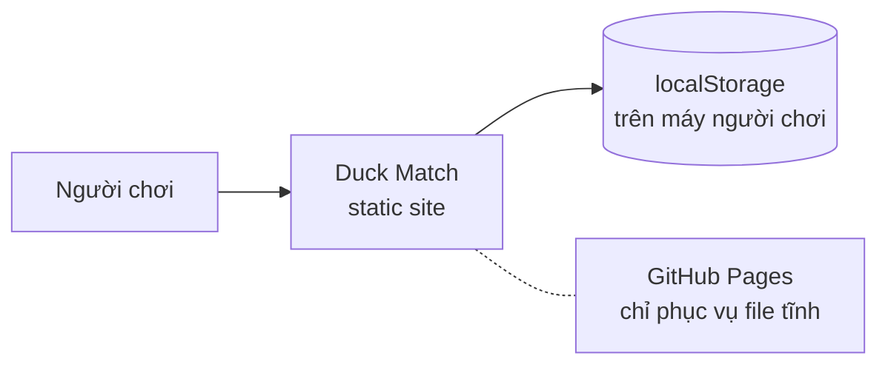
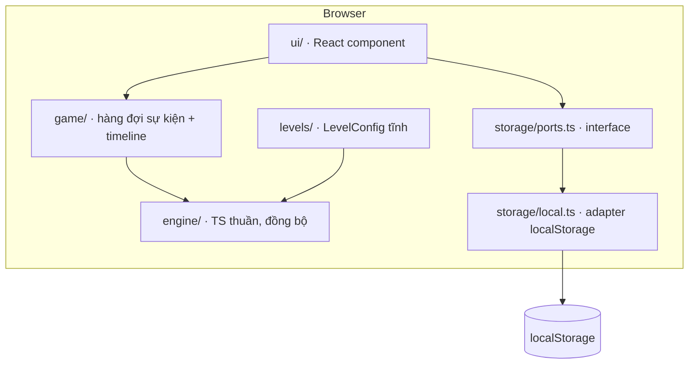

# Kiến trúc

> **Trả lời:** Hệ thống ghép lại thế nào, ranh giới giữa các phần ở đâu?
> **Trạng thái:** 🟢 đủ
> **Cập nhật:** 2026-09-04 · commit feat/core-engine-and-goals
> **Cập nhật khi:** thêm/bỏ một module hoặc service · đổi cách hai module nói chuyện

<!-- CÁCH ĐIỀN
Mức độ: C4 mức 1 (context) và mức 2 (container). KHÔNG đi xuống class hay function —
đó là code, và code là bản mô tả chính xác nhất của chính nó.

Mục 3 (ranh giới module) là mục AI dùng nhiều nhất: nó quyết định code mới nên đặt
ở đâu. Viết mỗi module một dòng: tên · trách nhiệm một câu · được phép gọi ai.

Mục 5 chỉ ghi TÊN công nghệ + số ADR. LÝ DO chọn nằm trong ADR, không nằm đây —
nếu lý do bị chép vào đây thì hai bản sẽ lệch.

KHÔNG chứa: lý do chọn công nghệ (-> decisions/), bất biến (-> invariants.md),
schema chi tiết (-> file schema của ORM), danh sách chức năng (-> 02-requirements/scope.md).
-->

## 1. Context — hệ thống nằm giữa ai với ai

Không có server của riêng dự án, không có datastore trung tâm, không hệ thống ngoài
nào. Đây là hệ quả trực tiếp của trần chi phí 0 đồng trong `overview.md` §5.

## 2. Container — hệ thống gồm những khối chạy được nào

Chỉ có **một** khối chạy được: bundle tĩnh trong trình duyệt. Các mũi tên ở trên là
ranh giới module trong cùng bundle đó, không phải process riêng.

## 3. Module và ranh giới

| Module | Trách nhiệm một câu | Được phép gọi | **Không** được gọi |
| --- | --- | --- | --- |
| `engine/` | Quyết định kết quả một nước đi và phát ra danh sách sự kiện | chỉ chính nó | React · DOM · `window` · `Date` · `Math.random` · `storage/` · `levels/` |
| `game/` | Giữ `Session`, phát lại `GameEvent[]` thành animation, khoá input khi đang chạy | `engine/` · React | DOM trực tiếp · `storage/local.ts` |
| `ui/` | Vẽ, nhận thao tác chuột/chạm/bàn phím | `game/` · `storage/ports.ts` · `i18n/` | `engine/` trực tiếp · `storage/local.ts` |
| `storage/ports.ts` | Khai báo `ProgressRepository` — cổng để sau cắm backend (ADR-0001) | — | bất cứ gì |
| `storage/local.ts` | Hiện thực `ProgressRepository` bằng localStorage | `storage/ports.ts` | `engine/` · `ui/` |
| `levels/` | Dữ liệu 6 màn dạng `LevelConfig`, không có logic | `engine/types` | mọi thứ khác |
| `i18n/` | Chuỗi hiển thị tiếng Việt | — | bất cứ gì |

`storage/local.ts` được import ở **đúng một chỗ**: điểm khởi tạo app. Mọi nơi khác
chỉ thấy interface — đó là điều làm FR-14 khả thi mà không sửa `engine/`.

## 4. Luồng dữ liệu của đường đi quan trọng nhất

Một nước đi của người chơi:

1. `ui/Board` nhận cử chỉ kéo (hoặc hai lần `Enter` bằng bàn phím) → gọi
   `game.trySwap(from, to)`.
2. `game/useGameSession` gọi **một lần duy nhất** `engine.applySwap(session, from, to)`
   và nhận về `{ session, events }`. Từ lúc này trạng thái logic đã xong hoàn toàn.
3. `game/timeline` dịch `events` thành các bước animation có thời lượng, đẩy vào hàng
   đợi. Input bị khoá cho đến khi hàng đợi rỗng.
4. `ui/` render theo từng bước; điểm và mục tiêu trên HUD lấy từ `events`, không tự
   tính.
5. Nếu `events` có `levelWon`/`levelLost` → `ui/ResultDialog` mở, và **chỉ khi thắng**
   `ui/` gọi `ProgressRepository.save()` với sao + điểm cao + màn mở thêm.

Ghi tiến độ nằm ở `ui/`, không nằm ở `engine/` — vì engine không được biết lưu trữ
tồn tại. Đây là lý do bước 5 là bước duy nhất chạm `storage/`.

## 5. Tech stack

| Lớp | Công nghệ | Biện minh |
| --- | --- | --- |
| Framework | Next.js 15 (App Router, `output: 'export'`) | ADR-0004 |
| UI | React 19 + TypeScript strict | ADR-0004 |
| Style | Tailwind CSS | ADR-0004 |
| Toolchain | Yarn classic | ADR-0004 |
| Luật chơi | TypeScript thuần, đồng bộ, không thư viện game | ADR-0002 |
| Ngẫu nhiên | PRNG mulberry32 có seed, tự viết | ADR-0003 |
| Lưu trữ | localStorage sau interface `ProgressRepository` async | ADR-0001 |
| Test | Vitest + happy-dom + Testing Library · Playwright cho luồng | ADR-0002 |
| Host | GitHub Pages, static export ra `out/` | ADR-0004 |
